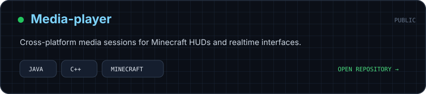
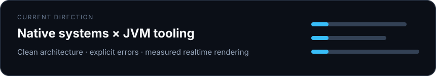

<div align="center">
  
</div>

## `> about_me`

```java
public final class Friz1iks {
    String focus = "clean JVM APIs over native systems";
    String[] languages = {"Java", "C++", "Rust", "Python", "Go"};
    String[] interests = {"Minecraft", "JNI", "realtime UI", "rendering"};
    String status = "} catch (Exception e) {";
}
```

Я пишу JVM- и native-инструменты, связываю Java с системными API и люблю превращать низкоуровневую логику в удобные библиотеки. Основные направления — Minecraft-интерфейсы, кастомный рендер, realtime-состояния, JNI и кроссплатформенная архитектура.

## `> stack`

<div align="center">
  &nbsp;&nbsp;&nbsp;
  &nbsp;&nbsp;&nbsp;
  &nbsp;&nbsp;&nbsp;
  &nbsp;&nbsp;&nbsp;
  &nbsp;&nbsp;&nbsp;
  &nbsp;&nbsp;&nbsp;
  
</div>

## `> featured_project`

<div align="center">
  <a href="https://github.com/Friz1iks/Media-player">
    
  </a>
</div>

`Media-player` — кроссплатформенный Java API для системных медиасессий, управления воспроизведением, обложек и синхронизированного текста. Библиотека рассчитана на Minecraft HUD, кастомные анимации и realtime-рендер.

## `> currently_building`

<div align="center">
  
</div>

## `> principles`

```text
clean architecture  > accidental complexity
explicit errors     > silent failures
reusable APIs       > one-off code
measured rendering  > work on every frame
```

<div align="center">
  <sub>building things that feel simple on the outside and stay solid underneath</sub>
</div>

<details>
  <summary>banner variants</summary>
  <br />
  
  <br /><br />
  
</details>
